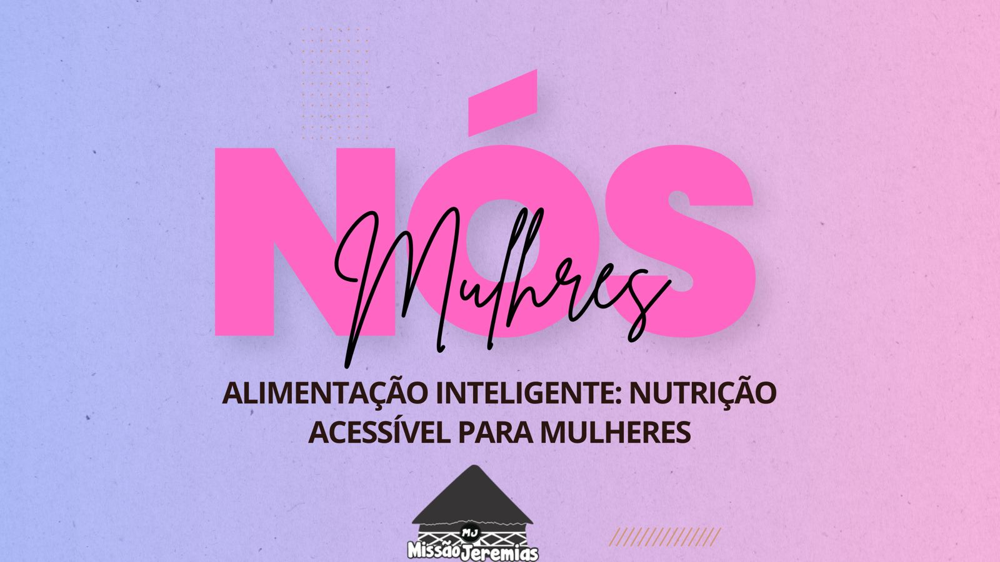

# Nós mulheres
Aplicação desenvolvida para atender um grupo de mulheres que se reúnem para se empoderar através da iformção

## Features:
 **CSS3** - Utilizado para desenvolver o estilo das páginas

 **HTML5** - Utilizado para desenvolver as marcações das páginas

 **Javascript** - Utilizado para desenvolver as interações do usuário com as páginas, bem como a experiência de APP por meio da PWA

 **PHP** - Utilizado para desenvolver o backend da aplicação e conexão com o banco de dados

 **Mysql** - Utilizado para desenvolver e gerenciar as tabelas no banco de dados
